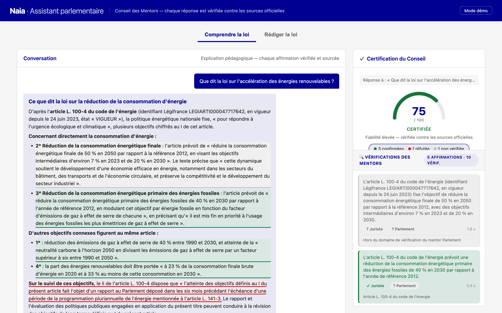
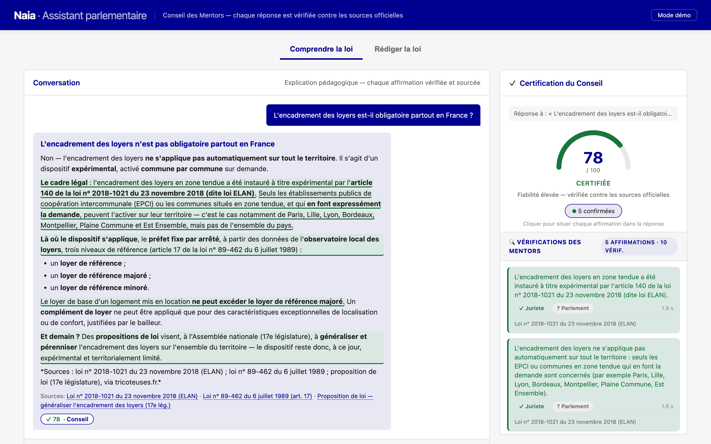
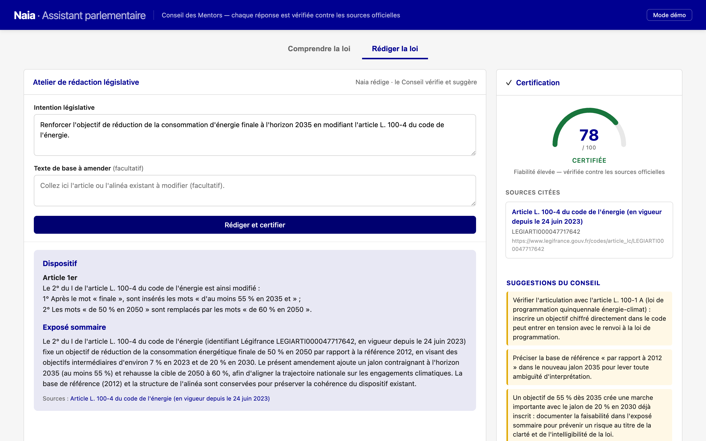
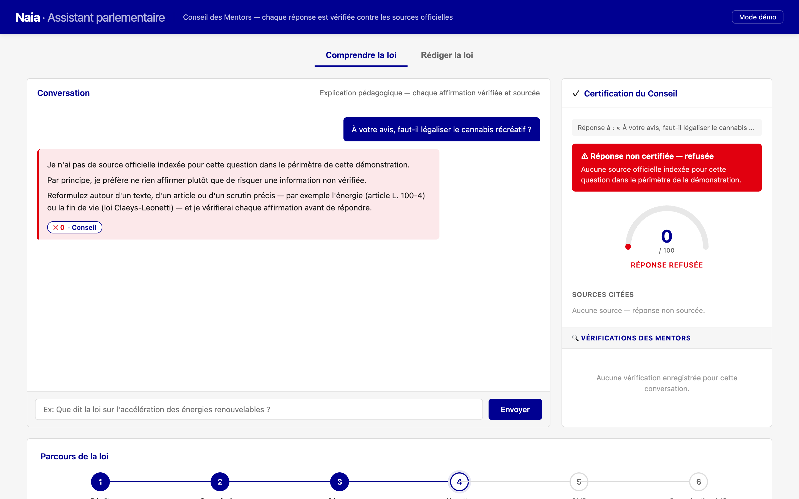

# DEFI.md

### Nom du défi
Naia : l'IA parlementaire qui ne répond que ce qu'elle peut prouver

### Description courte
Les IA répondent toujours — même quand elles ne savent pas. En droit, une hallucination devient une désinformation citoyenne, ou l'erreur d'un élu. Naia ne délivre une réponse que si elle est sourcée sur les textes officiels (Légifrance, données de l'Assemblée et du Sénat). Avant tout envoi, un Conseil des Mentors vérifie chaque affirmation. Trois issues : certifiée, insuffisante, ou refusée — jamais une quatrième où elle invente.

### Porteur
Agentik

### Description longue

**Le problème.** Une IA qui hallucine une loi ne fait pas une erreur anodine : elle fabrique une désinformation qui engage un citoyen ou un législateur. Les modèles génériques sont conçus pour toujours répondre, avec assurance, sans que rien ne soit vérifiable. Un usage parlementaire exige l'inverse : chaque affirmation doit être traçable jusqu'à un texte officiel.

**La réponse : ne répondre que ce qu'on peut prouver.** Naia rédige un brouillon, puis en extrait chaque affirmation (*claim*) une par une. Avant tout envoi, un **Conseil des Mentors** vérifie chaque affirmation contre les sources officielles : un mentor-juriste la confronte à Légifrance / au Journal officiel, un mentor-parlement aux dossiers, amendements et scrutins de l'Assemblée et du Sénat. Le passage du brouillon à la réponse est un **gate imposé par le code**, pas laissé à la discrétion du modèle — et l'utilisateur voit le pipeline travailler en direct, affirmation par affirmation.

**Trois issues, jamais une quatrième.**
- **Certifiée** — chaque affirmation est sourcée, la réponse part avec ses citations.
- **Insuffisante** — les sources ne sont pas concluantes : Naia le dit plutôt que de deviner.
- **Refusée** — le Conseil détecte une contradiction avec les textes : Naia bloque la réponse.

**Trois temps de la loi, une seule exigence de preuve.** *Produire* : aider le député à rédiger un texte dont chaque référence est certifiée (atelier « Rédiger la loi »). *Contrôler* : éclairer votes, amendements et parcours législatif via les données Assemblée/Sénat. *Évaluer* : rendre la loi compréhensible au citoyen, avec un score de confiance sur chaque réponse.

**Ce qui tourne déjà.** Des sujets réels certifiés sur les textes officiels — énergie (art. L. 100-4 du code de l'énergie), fin de vie (loi Claeys-Leonetti), encadrement des loyers (loi ELAN), et un cas de contrôle : PLF 2026, engagement de responsabilité (art. 49 al. 3) et motions de censure rejetées. Chaque verdict est écrit dans un journal d'audit (JSONL) — claim, mentor, verdict, source, horodatage — auditable après coup : une base directement compatible avec une logique de conformité type AI Act.

**Pourquoi c'est possible aujourd'hui.** Trois briques convergent enfin : des modèles capables de rédiger ET de s'auto-contrôler ; un accès direct aux sources officielles via MCP (Légifrance, Assemblée, Sénat) ; et une architecture de vérification — le Conseil des Mentors — qui impose par le code un passage prouvé entre le brouillon et la réponse.

> La question n'est pas « est-ce que l'IA peut répondre ? » — c'est « est-ce qu'elle sait dire non ».

### Image principale

### Contributeurs
- Jeremy André
- Mathieu Belmain

### Ressources utilisées
Cochez les ressources utilisées en remplaçant `[ ]` par `[x]`.

- [ ] `openfisca-france-parameters` — Base de données de paramètres ✺ OpenFisca
- [x] `an-dossiers-legislatifs` — Dossiers législatifs de l'Assemblée nationale (législature courante) ✺ Assemblée nationale
- [ ] `an-amendements-xvii` — Amendements déposés à l'Assemblée nationale (législature actuelle) ✺ Assemblée nationale
- [ ] `an-comptes-rendus` — Comptes rendus de la séance publique à l'Assemblée nationale (législature actuelle) ✺ Assemblée nationale
- [x] `an-votes-xvii` — Votes des députés (législature actuelle) ✺ Assemblée nationale
- [ ] `an-deputes-en-exercice` — Députés en exercice ✺ Assemblée nationale
- [ ] `an-deputes-historique` — Historique des députés ✺ Assemblée nationale
- [ ] `an-deputes-senateurs-ministres-par-legislature` — Députés, sénateurs et ministres d'une législature ✺ Assemblée nationale
- [ ] `an-agenda-reunions` — Agenda des réunions à l'Assemblée nationale (législature courante) ✺ Assemblée nationale
- [ ] `an-questions-gouvernement` — Questions de l'Assemblée nationale au Gouvernement ✺ Assemblée nationale
- [ ] `an-questions-gouvernement-ecrites` — Questions écrites de l'Assemblée nationale au Gouvernement ✺ Assemblée nationale
- [ ] `an-questions-gouvernement-orales` — Questions orales de l'Assemblée nationale au Gouvernement ✺ Assemblée nationale
- [x] `premier-ministre-legi` — Codes, lois et règlements consolidés ✺ Premier ministre
- [x] `premier-ministre-dole` — Dossiers législatifs Légifrance ✺ Premier ministre
- [x] `premier-ministre-jorf` — Édition ''Lois et décrets'' du Journal officiel ✺ Premier ministre
- [ ] `senat-dispositifs-textes` — Dispositifs des textes déposés ou adoptés au Sénat ✺ Sénat
- [ ] `senat-dossiers-legislatifs` — Dossiers législatifs du Sénat ✺ Sénat
- [ ] `senat-amendements` — Amendements déposés au Sénat ✺ Sénat
- [ ] `senat-senateurs` — Sénateurs ✺ Sénat
- [ ] `senat-questions-gouvernement` — Questions orales et écrites du Sénat au Gouvernement ✺ Sénat
- [ ] `senat-comptes-rendus` — Comptes rendus de la séance publique au Sénat ✺ Sénat
- [ ] `an-et-co-database-regroupement-toutes-donnees` — Base de données unifiée Parlement / Législation / Service Public ✺ Assemblée nationale & communauté
- [ ] `an-et-co-serveur-mcp-regroupement-toutes-donnees` — Serveur MCP  - Accès unifié Parlement / Législation / Service Public ✺ Assemblée nationale & communauté
- [ ] `an-et-co-api-regroupement-toutes-donnees` — API - Accès unifié Parlement / Législation / Service Public ✺ Assemblée nationale & communauté
- [ ] `legiwatch-api-parlement` — API Parlement ✺ LegiWatch
- [ ] `legiwatch-database-parlement` — Base de données Parlement ✺ LegiWatch
- [ ] `legiwatch-serveur-mcp-parlement` — Serveur MCP Parlement ✺ LegiWatch

### Galerie

### Documents
- [Présentation du défi](docs/naia-defi-presentation.md)
- [Diapositives détaillées (11 slides)](docs/diapositives-detaillees.pdf)

### URL de démonstration
https://local-3000.clipgen.co/

### Diapositives de présentation
[Diapositives de présentation](docs/diapositives.pdf)
